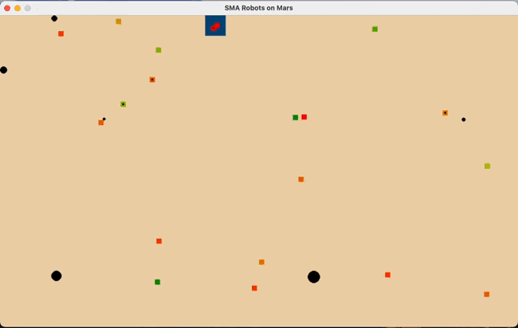

# SMA TP4 : BDI Architecture for mining robots on Mars

**Authors** : [@paulflagel](https://github.com/paulflagel/), [@nathanetourneau](https://github.com/nathanetourneau)

Master 2 IA - Université Lyon 1 - 2021-2022

___

This project based on [pygame](https://www.pygame.org) aims at implementing a multi-agent system made of robots under a Belief-Desire-Intention (BDI) architecture.

The robots come from a base and have to explore the planet to mine stone deposits. They don't know their absolute coordinates, and move in a random direction until a deposit appears in their field of vision, or a nearby neighbor informs them that a deposit is nearby. Once the robot has retrieved its stones, it returns directly to its base from which it always knows the direction, to deposit their stones and then start looking for deposits again. The deposits decrease as they are mined by the robots and the simulation ends when no more deposits are available. 

In order for each robot to carry out its objectives independently of the others, the simulation is multithreaded _i.e._ each agent evolves in its own thread, and works regardless of the actions performed by the other agents.

## Get started

Clone this repo and `cd` to it

`pip install -r requirements.txt` to install all the dependencies

Change the number of robots you want in the `main.py` file and optionally the `WIDTH` and `HEIGHT` arguments

Finally run `python main.py` or `python3 main.py` if Python 3 is not your default interpreter
